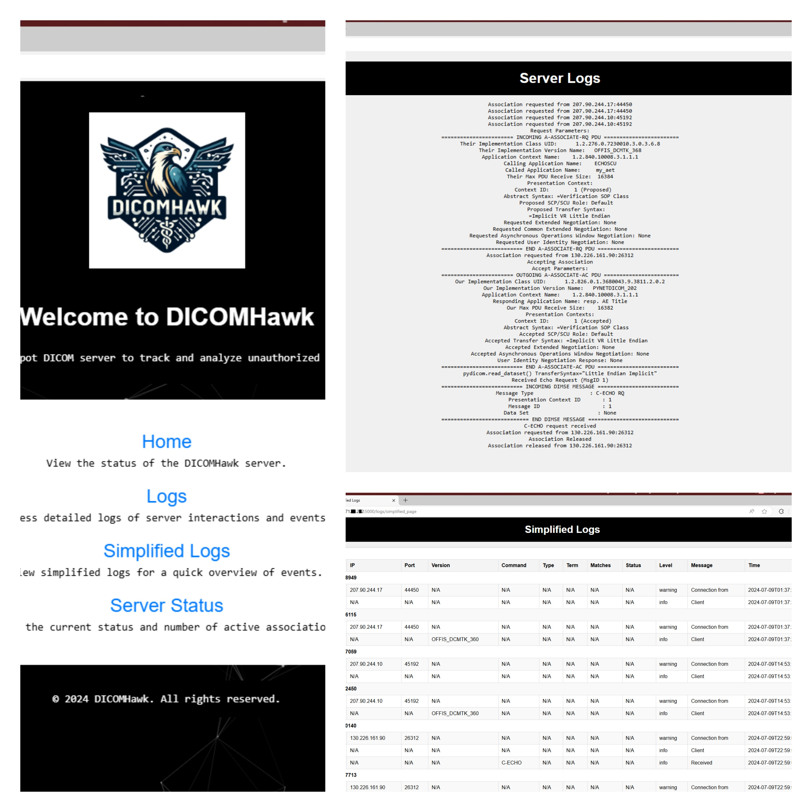

# DICOMHawk


DICOMHawk is a powerful and efficient honeypot for DICOM servers, designed to attract and log unauthorized access attempts and interactions. Built using Flask and pynetdicom, DICOMHawk offers a streamlined web interface for monitoring and managing DICOM interactions in real-time.

## Features

- **DICOM Server Simulation**: Supports C-ECHO, C-FIND, and C-STORE operations to simulate a realistic DICOM server environment.
- **Logging**: Detailed logging of DICOM associations, DIMSE messages, and event-specific data to track and analyze potential attacks.
- **Web Interface**: A user-friendly web interface to view server status, active associations, and logs.
- **Custom Handlers**: Easily extendable to support additional DICOM services and custom logging or handling requirements.

## Getting Started

### Prerequisites

- Docker installed on your machine
- DCMTK tools installed on your local machine for testing

### Installation

1. **Clone the repository**:

    ```bash
    git clone https://github.com/gtheodoridis/DICOMHawk.git
    cd dicomhawk
    ```

2. **Build the Docker image**:

    ```bash
    docker build -t dicomhawk .
    ```

3. **Run the Docker container**:

    ```bash
    docker run -d -p 5000:5000 -p 11112:11112 --name dicomhawk_container dicomhawk
    ```

    This command runs the container in detached mode, exposing the web interface on port 5000 and the DICOM server on port 11112. Alternatively, port 104 is also applicable for DICOM (ACR-NEMA).

### Usage

1. **Access the Web Interface**:

    Open a web browser and go to `http://127.0.0.1:5000` to access the DICOMHawk web interface. Here, you can monitor server status, view active associations, and check the logs.

    

2. **Test the DICOM Server**:

    Use DCMTK tools to interact with the DICOM server.

    - **C-ECHO (DICOM Echo Test)**:

        ```bash
        echoscu 127.0.0.1 11112
        ```

    - **C-FIND (DICOM Find Test)**:

        Create a query file, `query.dcm`, with the following content:

        ```plaintext
        (0008,0052) CS [STUDY]                            # QueryRetrieveLevel
        (0010,0010) PN [Baggins^Frodo]                         # Patient's Name
        ```

        Run the C-FIND command:

        ```bash
        findscu -v -S -k QueryRetrieveLevel=STUDY -k PatientName=Baggins^Frodo 127.0.0.1 11112
        ```

    - **C-STORE (DICOM Store Test)**:

        To send a DICOM file to the server, use the `storescu` command:

        ```bash
        storescu 127.0.0.1 11112 path/to/your/file.dcm
        ```

### Development

If you want to make changes to DICOMHawk or extend its functionality, you can do so by modifying the source code. Once you've made your changes, rebuild the Docker image and restart the container:

1. **Rebuild the Docker image**:

    ```bash
    docker build -t dicomhawk .
    ```

2. **Restart the Docker container**:

    ```bash
    docker stop dicomhawk_container
    docker rm dicomhawk_container
    docker run -d -p 5000:5000 -p 11112:11112 --name dicomhawk_container dicomhawk
    ```

### Logs and Monitoring

DICOMHawk provides detailed logging to help you monitor and analyze interactions with the DICOM server:

- **Server Logs**: Access logs to see detailed information about DICOM associations and DIMSE messages.
- **Simplified Logs**: View simplified logs for a quick overview of events.

You can view these logs through the web interface or by accessing the log files directly within the Docker container.

### Troubleshooting

- **Container Not Starting**: Ensure that the ports 5000 and 11112 are not being used by other applications.
- **No Logs**: Verify that the logging directories exist and have the correct permissions.

For more detailed troubleshooting, check the Docker container logs:

```bash
docker logs dicomhawk_container
